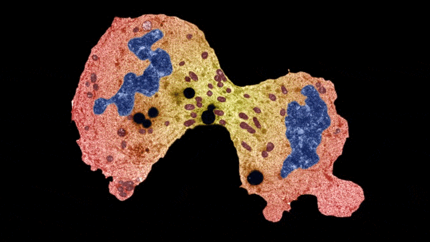

# Human_DNA_Gene-Segmentation-with-K-Means-Clustering Algorithm

# Library Installations:
 
- run: 
- pip install cv2
- pip install matplotlib
- pip install numpy

# Usuage

- Open JupyterNotebook - Run Segmentation_with_K_Means_Clustering.ipynb

If you like this work please help me by giving me some stars.
